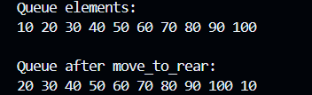
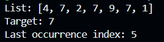
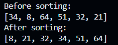

# CS 303 Assignment 3

**Name:** Syed Abdul Mateen Shah  

---

## How to Run

1. Compile all Java files
2. Run each file separately:

- `Main.java` → Question 1 (Queue implementation)
- `RecursiveSearch.java` → Question 2 (Recursive search)
- `QueueInsertionSort.java` → Question 3 (Insertion sort)

---

## Files Included

- MyQueue.java  
- Main.java  
- RecursiveSearch.java  
- QueueInsertionSort.java  

---

## Description

### Question 1
Implemented a generic queue using a linked list.  
Includes functions: `offer`, `poll`, `peek`, `size`, `empty`, and `move_to_rear`.

### Question 2
Used recursion to find the **last occurrence** of a target element in an ArrayList.

### Question 3
Modified insertion sort code from lecture to sort a queue of integers.

---

## Output Screenshots

### Question 1 Output

### Question 2 Output

### Question 3 Output
